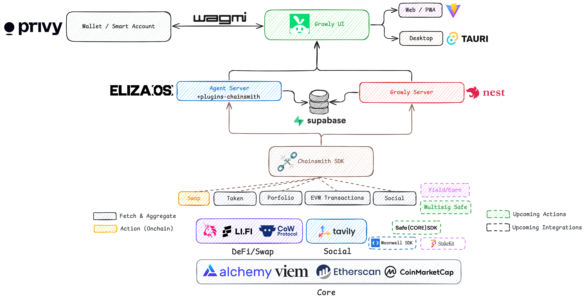

# Growly - Smart AI Portfolio

- Link to Frontend App demo: https://youtu.be/ay0k7SLdziw
- Link to Agent demo: https://www.youtube.com/watch?v=qSdMv3Tuprk

## Description


Introducing Growly – Your Personalized Crypto Portfolio Management Assistant

Growly is an AI-powered portfolio manager designed to optimize crypto investments based on your risk profile and portfolio data. Unlike traditional financial services, Growly builds long-term memory to understand your investment behavior better, ensuring tailored strategies that evolve with your needs.

## Architecture



- app: web app, desktop ui
- core: chainsmith core
- agent: agent code built on top of ElizaOS framework

## ✨ Key Features of Growly:

Personalized AI Assistant: 
- Analyzes historical portfolio data (across multiple wallets), P/L, and user risk appetite surveys to refine investment strategies.
- Intelligent Portfolio Management: Dynamically allocates, rebalances, and optimizes assets across staking, lending, and liquidity pools.
- Secure & Controlled Execution: Trades are only executed with the portfolio owner's approval via Safe’s threshold signatures.
- Data-Enriched Decision Making: Powered by pre-aggregated data from the Chainsmith SDK, Growly efficiently handles Web3-specific data lookups for smarter investment decisions.
- Seamless Integration: Well-integrated with the ElizaOS architecture for enhanced AI performance.

Future Enhancements: 
-Weekly portfolio performance reports delivered via email or Telegram for better tracking and insights.

## Local Setup

- Node 23. Please check `nvm use 23` to avoid startup error
- `bun install` at root
- Go to each package and setup the environment variables file (.env)

```bash
cp .env.example .env
```

### Agent

To start agent (at root): `bun start:agent`

This is built on top of [ElizaOS](https://github.com/elizaOS/eliza), bootstrap with [eliza-starter](https://github.com/elizaOS) but got removed some unused dependencies (client, plugins...).

Agent will need the most configuration (please find more details in `/app/agent/.env.example`).

There are 3 main parts

- **Server and Database**

By default, it will launch an ExpressJS server at port `:3000` and use SQLite as database. For production level (Supabase for online PostgreSQL), and multi-deployment with backend server in our case, the env variables should be set

```bash
####################################
#### Server & DB Configurations ####
####################################

# Eliza Port Config
SERVER_PORT=3000

SUPABASE_URL=
SUPABASE_ANON_KEY=

# Logging
DEFAULT_LOG_LEVEL=info
LOG_JSON_FORMAT=false            # Print everything in logger as json; false by default
```

- **LLM Model**

For production level, we will use OpenAI API key for convenience and stability. However, during the local development, to save credits and test with multiple models, we used Ollama to run open-source LLM models (like LLama3.2, DeepSeek R1,...).

```bash
###############################
#### Client Configurations ####
###############################

# OpenAI Configuration
OPENAI_API_KEY=         # OpenAI API key, starting with sk-
OPENAI_API_URL=         # OpenAI API Endpoint (optional), Default: https://api.openai.com/v1

# Local testing with Ollama
# Ollama Configuration
OLLAMA_SERVER_URL= # Default: localhost:11434
OLLAMA_MODEL=
USE_OLLAMA_EMBEDDING=   # Set to TRUE for OLLAMA/1024, leave blank for local
OLLAMA_EMBEDDING_MODEL= # Default: mxbai-embed-large
SMALL_OLLAMA_MODEL=     # Default: llama3.2
MEDIUM_OLLAMA_MODEL=    # Default: hermes3
LARGE_OLLAMA_MODEL=     # Default: hermes3:70b
```

To choose the ModelProvider, you can edit in `character.ts`

```ts
modelProvider: ModelProviderName.OLLAMA; // To use OLLAMA
// or
modelProvider: ModelProviderName.OPENAI; // To use OpenAI
```

By default, the `@elizaos/client-direct` (for ExpressJS server) will use Large model to process user prompt + the whole character file (`character.json` or `character.ts` in our case). With OpenAI:

- Large model will be `gpt-4o`
- Small model will be `gpt-4o-mini`

**Crypto/Chainsmith Config**
Currently, these are the core data providers for ChainsmithSDK to bootstrap the `plugin-chainsmith` on local

- [Alchemy](https://www.alchemy.com/): For RPC and some pre-processed API endpoints
- [Etherscan](https://etherscan.io/apis): For raw transactions and token transfer activities
- [CoinmarketCap](https://coinmarketcap.com/api/): For latest quote (price) with time-window percentage changes (up to 90 days) of listed tokens
- [Tavily](https://tavily.com/): For web, news, sentiment summary. For future scaling, we'll try to implement our all sentiment aggregator within Chainsmith SDK and infrastructure, instead of relying on external API.

```bash
######################################
#### Crypto Plugin Configurations ####
######################################

# CoinMarketCap / CMC
COINMARKETCAP_API_KEY=

# Alchemy
ALCHEMY_API_KEY=

# Etherscan
ETHERSCAN_API_KEY=

# EVM
EVM_PRIVATE_KEY=      # Agent private key for automation
EVM_WALLET_ADDRESS=   # Agent wallet address for automation

# TAVILY
TAVILY_API_KEY=
```

### Server

To start server (at root): `bun start:server`

The env variables are mostly similar to `agent` (for Alchemy, Etherscan, Coinmarkcap).

We're experiment with `Pimilico` (for Smart Account interaction) and extended `SimpleHash` API for price service.

```bash
ALCHEMY_API_KEY=

ETHERSCAN_API_KEY=

COINMARKETCAP_API_KEY=

PIMILICO_API_KEY=

SIMPLE_HASH_API_KEY=
```

### UI

To start front-end app (at root): `bun start:app`

It will need [Privy](https://www.privy.io/) settings for the wallet connector, as well as 2 ports where you deployed the Agent and Server

```bash
VITE_PRIVY_APP_ID=
VITE_PRIVY_CLIENT_ID=
VITE_SERVER_PORT=
VITE_AGENT_PORT=
```

## FaQ
